# 수업 2019. 09 .18
수업내용정리

이번 수업시간에서는 깃으로 html 과 markdown을 사용하여 과제를 제출하는방법에대해 배웠습니다.

첫째로 docs 파일수정을하고  
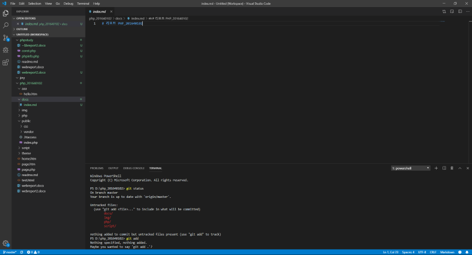</img>  
각 주차  경로를 설정 합니다.  
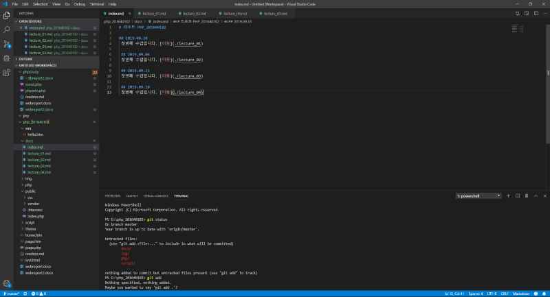  
  

예시로 이미지 삽입함.  
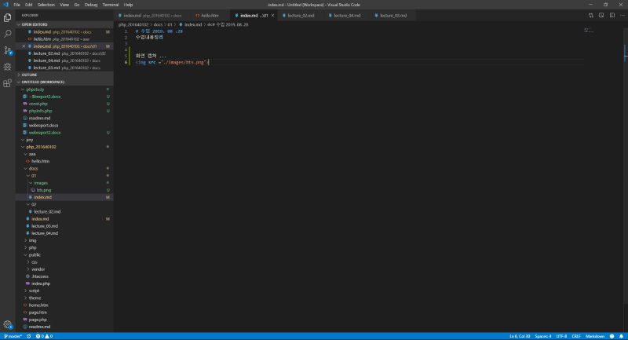  
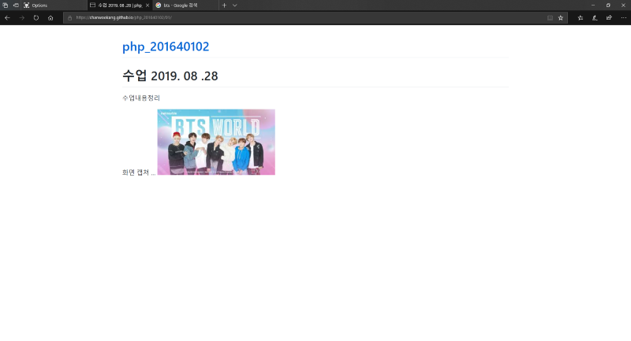  
### 최종본 
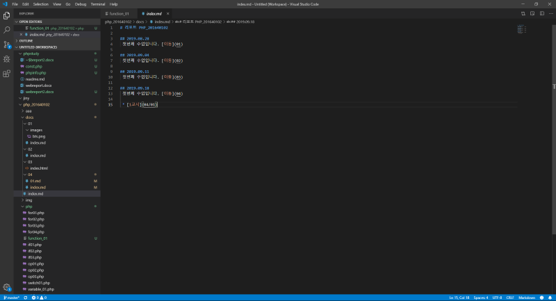  
  
마크다운에서는 ! 는 사진 * 는 목록을 의미한다

## PHP
php는 선언과 호출을 따로하는데 선언은 function 함수명(){} 호출은 함수명(); 이다
객체지향이므로 선언과 호출에 순서는 상관없으나 조건문인 경우에는 선언 호출이 순서가 필요하다.

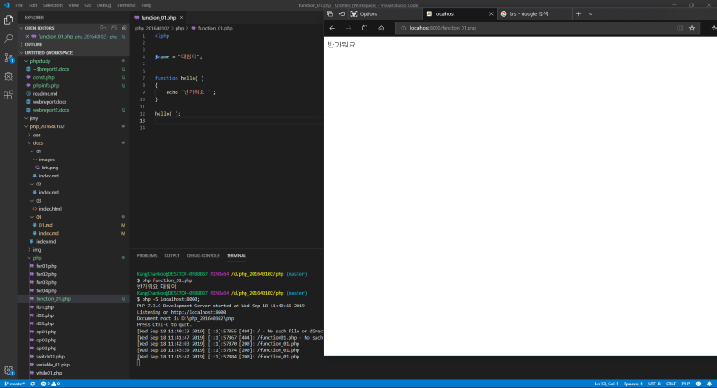  
  
  
  

함수로 호출 하는 방법
가변함수를 사용할땐 세미콜론을 사용해야한다.

  
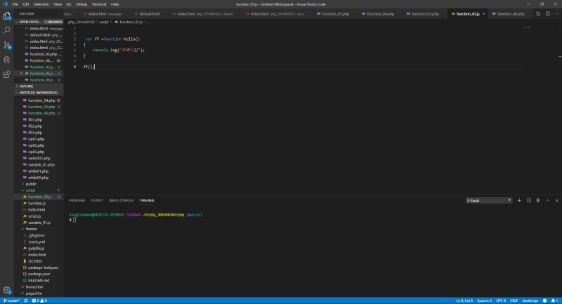  
switch를 사용
Switch는 똑같은 값을 찾아 수행한다.

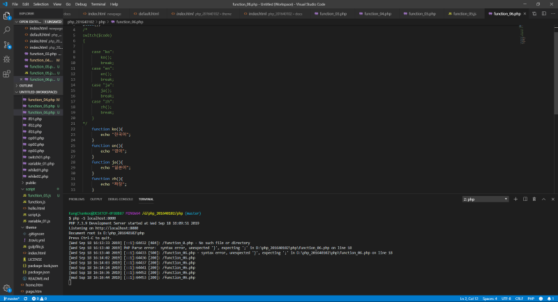  

재귀함수

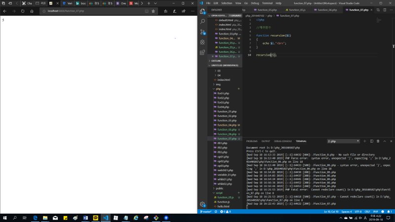  
  
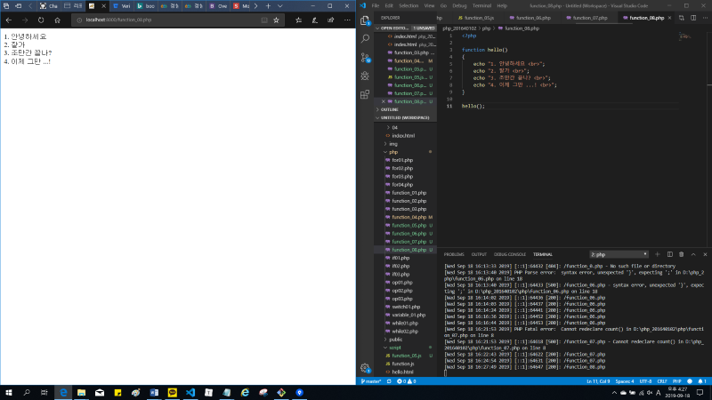  

## 소스트리를 사용하여 푸쉬

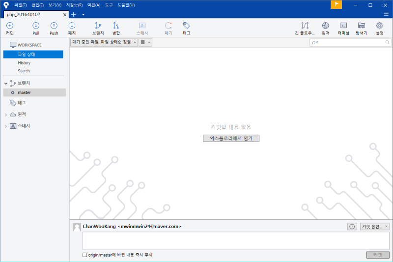  
과제를 올릴 페이지 꾸미기 (점보트론으로 컨테이너 생성)

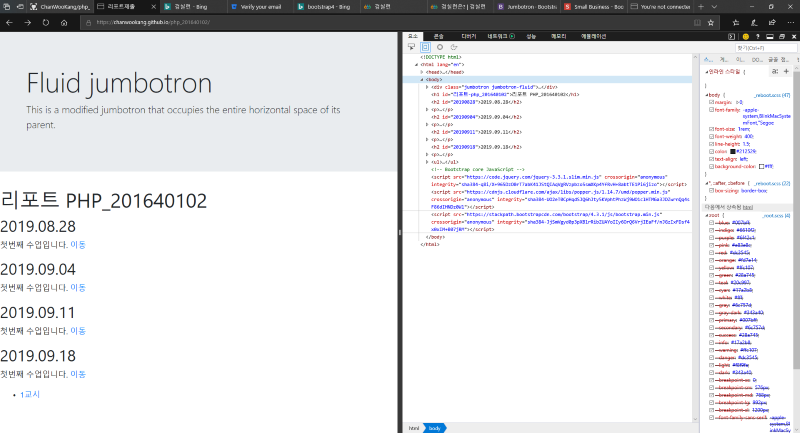 

그리드추가

  

레이아웃 꾸미기

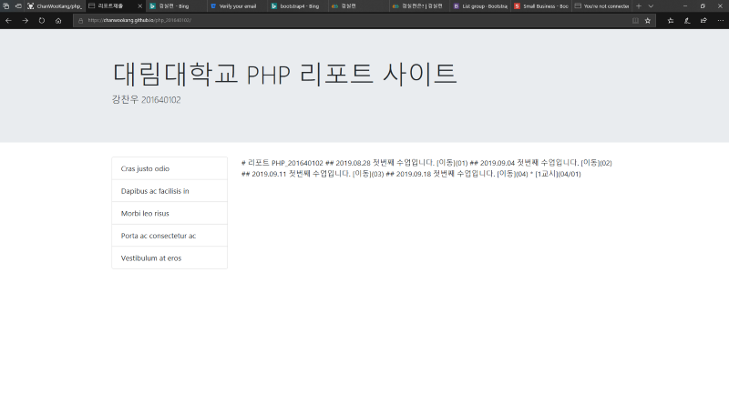 

깃허브에서 페이지가 천천히 갱신되는 이유는 프로그램을 돌려서 변환하기 때문에 
시간이 소요된다.